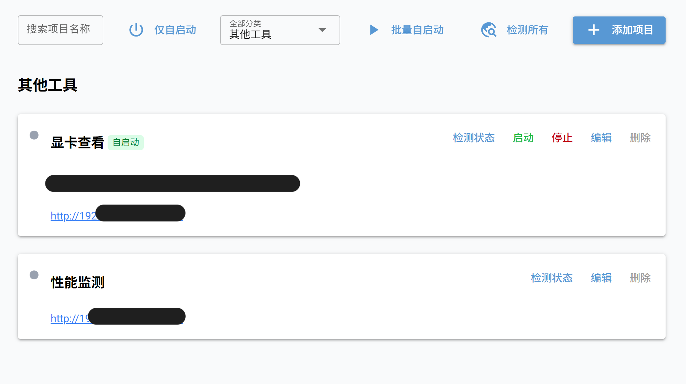

# 项目导航

**[English](README_EN.md)|[中文](README.md).**

基于 NiceGUI 的 Web 项目管理器，管理本地 Web 服务的启动、停止与状态监控。



## 功能

- **项目 CRUD** — 添加、编辑、删除项目，含名称、描述（Markdown）、地址、分类、启动/停止脚本路径
- **状态检测** — 检测项目 URL 连通性，绿/红/灰圆点指示运行状态
- **脚本执行** — 一键执行启动/停止脚本，支持自启动（开机 + 批量）
- **附属链接** — 每个项目可挂载多个附属链接
- **筛选搜索** — 按名称搜索、按分类筛选、仅看自启动项目
- **分类分组** — 项目按分类分组展示
- **脚本模板** — 编辑界面可查看启动/停止脚本模板

## 快速启动

```bash
pip install nicegui httpx
python main.py
```

访问 http://localhost:20001

## 环境变量

| 变量 | 默认值 | 说明 |
|---|---|---|
| `HOST` | `0.0.0.0` | 监听地址 |
| `PORT` | `20001` | 监听端口 |
| `PROJECTS_FILE` | `./projects.json` | 项目数据文件路径 |
| `LOG_FILE` | 系统临时目录 | 日志文件路径 |
| `START_TEMPLATE` | `./start_script_template.txt` | 启动脚本模板文件 |
| `STOP_TEMPLATE` | `./stop_script_template.txt` | 停止脚本模板文件 |

## Docker 部署

```bash
cd docker
mkdir data
docker compose up -d
```

- **宿主机网络** — 使用 `network_mode: host`，容器内 `localhost` 即宿主机 `localhost`
- **端口修改** — 通过 `PORT` 环境变量调整：`PORT=3000 docker compose up -d`
- **数据持久化** — 项目数据、日志、模板文件保存在 `docker/data/`
- **国内镜像** — 内置阿里云 PyPI 镜像
- **时区** — 默认 `Asia/Shanghai`

### 手动构建

```bash
docker compose build --no-cache
docker compose up -d
```

## 启动 / 关闭脚本参考

项目中的启动/关闭脚本由 `subprocess` 直接执行。建议用 `tmux` 或 `screen` 隔离进程，便于管理。

### 启动脚本示例（tmux）

```bash
#!/bin/bash

LOG="/path/to/your_project/log.out"
SESSION_NAME="my_project"

echo "[$(date)] Starting service..." >> "$LOG"

if tmux has-session -t "$SESSION_NAME" 2>/dev/null; then
    tmux kill-session -t "$SESSION_NAME"
fi

tmux new-session -d -s "$SESSION_NAME"
tmux send-keys -t "$SESSION_NAME" 'cd /path/to/your_project' C-m
tmux send-keys -t "$SESSION_NAME" './start_service.sh' C-m
tmux detach-client -t "$SESSION_NAME"
echo "[$(date)] Service started." >> "$LOG"
```

### 关闭脚本示例（tmux）

```bash
#!/bin/bash

SESSION_NAME="my_project"

if tmux has-session -t "$SESSION_NAME" 2>/dev/null; then
    tmux kill-session -t "$SESSION_NAME"
fi
```

### 模板文件位置

```
项目目录/
├── main.py
├── start_script_template.txt
├── stop_script_template.txt
├── projects.json
├── imgs/
│   └── overview.png
└── docker/
```

## 致谢

感谢 [opencode](https://opencode.ai) 提供的 AI 辅助开发支持。
